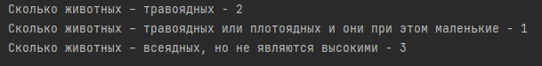

# Описание
> Программа считает кол-во животных совпадающих по определенным правилам

---
## Запуск
Программа принимает аргументы:
- Обязательно - Путь до файла config.properties с настройками

- Путь до файла с правилами И путь до файла с данными
- Путь до файла с правилами И путь до файла с данными И путь до выходного файла

## Техническое задание

> Создать простую система учета животных. 

Каждое животное *имеет* **набор свойств**.
Каждое **свойство** *имеет* **набор параметров**

Пример:

| Свойство | Набор параметров                 |
| -------- | -------------------------------- |
| ВЕС      | ЛЕГКОЕ, СРЕДНЕЕ, ТЯЖЕЛОЕ         |
| РОСТ     | МАЛЕНЬКОЕ, НЕВЫСОКОЕ, ВЫСОКОЕ    |
| ТИП      | ТРАВОЯДНОЕ, ПЛОТОЯДНОЕ, ВСЕЯДНОЕ |

Входная информация – **перечень животных** с указанием их свойств.
Пример:

| Перечень животных            |
| ---------------------------- |
| ЛЕГКОЕ,МАЛЕНЬКОЕ,ВСЕЯДНОЕ    |
| ТЯЖЕЛОЕ,МАЛЕНЬКОЕ,ТРАВОЯДНОЕ |
| ТЯЖЕЛОЕ,НЕВЫСОКОЕ,ТРАВОЯДНОЕ |

**Нужно разработать систему правил**, чтобы посчитать совпадения с правилами по входным данным, и выдать  результат на экран

1. Сколько животных – травоядных  
2. Сколько животных – травоядных или плотоядных и они при этом маленькие  
3. Сколько животных – всеядных, но не являются высокими

### Ограничения

> Программа не должна предполагать ручного ввода данных.
> Все данные брать из внешних  источниках (напр. файлы).  

> Программа не должна содержать внутри никаких констант, связанных со свойствами животных  или теми наборами параметров, которыми обладают.

> Программа не должна содержать логику для расчета по входным данным. Логика расчетов должна определяться перечнем правил, взятыми из внешнего источника (напр. файла).  

> Программа должна только исполнять эти правила. Набор поддерживаемых правил, можно  ограничить только теми, которые необходимы для вычислений.

## Пример

> Путь файла с данными /data/data.txt

| Данные                       |
| ---------------------------- |
| ЛЕГКОЕ,МАЛЕНЬКОЕ,ВСЕЯДНОЕ    |
| ЛЕГКОЕ,НЕВЫСОКОЕ,ПЛОТОЯДНОЕ  |
| ЛЕГКОЕ,МАЛЕНЬКОЕ,ВСЕЯДНОЕ    |
| СРЕДНЕЕ,НЕВЫСОКОЕ,ВСЕЯДНОЕ   |
| ТЯЖЕЛОЕ,МАЛЕНЬКОЕ,ТРАВОЯДНОЕ |
| ТЯЖЕЛОЕ,НЕВЫСОКОЕ,ТРАВОЯДНОЕ |

> Путь файла с правилами /data/rule.txt

| Правило                                 | Описание                                                              |
| --------------------------------------- | --------------------------------------------------------------------- |
| ТРАВОЯДНОЕ                              | Сколько животных – травоядных                                         |
| (ТРАВОЯДНОЕ ИЛИ ПЛОТОЯДНОЕ) И МАЛЕНЬКОЕ | Сколько животных – травоядных или плотоядных и они при этом маленькие |
| ВСЕЯДНОЕ И (НЕВЫСОКОЕ ИЛИ МАЛЕНЬКОЕ)                   | Сколько животных – всеядных, но не являются высокими                  |

#### Результат работы программ
